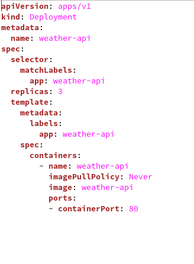

# Running a .Net Core Web API Service on Minikube

**Prerequisite**

* Linux machine with Minikube [Install Minikube](https://github.com/salman-mukhtar/setting-up-kubernetes-environment/blob/master/README.md)
* Visual studio code
* Docker
* Kubectl

**Setting up .Net Core Web API**

We can start with a .net core web api as an example. The service application will run on Docker. To create it, we can proceed with the terminal command below.

```
dotnet new webapi -o WeatherAPI
```
This will create a project with necessory structure. Run the api by typing following on terminal.

```
dotnet run
```

Weather API will return random weather forcasting as shown below.

|  |
| ------------------------------------------------------------------- |

To dockerize the Web API application, we need the Dockerfile file, as you are familiar with, that we can encode it as follows.

```
FROM mcr.microsoft.com/dotnet/core/sdk:3.1 AS build-env
WORKDIR /app

# Copy csproj and restore as distinct layers
COPY WeatherAPI/*.csproj ./
RUN dotnet restore

# Copy everything else and build
COPY WeatherAPI/. ./
RUN dotnet publish -c Release -o out

# Build runtime image
FROM mcr.microsoft.com/dotnet/core/aspnet:3.1
WORKDIR /app
COPY --from=build-env /app/out .
ENTRYPOINT ["dotnet", "WeatherAPI.dll"]
```
**Docker Preparations**

After completing the dockerfile file, the web API application can be started to dockerize. After all, Minikube's main task is to provide orchestration of dockerized samples. For dockerize process, it will be enough to use the build command as follows.

```
docker build -t weather-api .
```
|  |
| ------------------------------------------------------------------- |

**Minikube Deployment Preparations**

First of all we create a deployment file to run our pods on Minikube. The deployment file will look as follows.

```
apiVersion: apps/v1
kind: Deployment
metadata:
  name: weather-api
spec:
  selector:
    matchLabels:
      app: weather-api
  replicas: 1
  template:
    metadata:
      labels:
        app: weather-api
    spec:
      containers:
        - name: weather-api
          imagePullPolicy: Never
          image: weather-api
          resources:
            limits:
              memory: "50Mi"
              cpu: "50m"
            requests:
              memory: "20Mi"
              cpu: "20m"
          ports:
          - containerPort: 80
```

After the Docker image is ready, the required distribution process can be started for the minikube. In this note, we use the kubectl command line tool. kubectl will perform a deployment process using the contents of the deployment.yaml file. We can perform these operations with the following terminal commands. Before starting these operations, I would like to remind you that minikube service must be running.

Now we apply our deployment.
```
kubectl create -f deployment.yaml
```

|  |
| ------------------------------------------------------------------- |

```
kubectl get deployments
kubectl get pods
```

|  |
| ------------------------------------------------------------------- |
